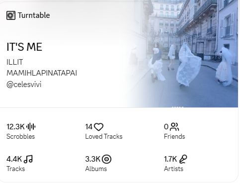
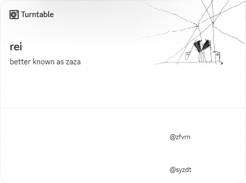

# Turntable


A customizable Discord Social SDK widget powered by Last.fm.

## Features

- 🎵 Live Last.fm scrobbling
- 🖼️ Album artwork with fallback
- 👤 Personal profile mode
- 🎧 Music mode
- 🔄 Auto updates
- 📊 Listening statistics

## Installation

```bash
git clone https://github.com/rziy/turntable.git
cd turntable
npm install
```

Create a `.env` file:

```env
LASTFM_USER=
LASTFM_API_KEY=
DISCORD_APP_ID=
DISCORD_USER_ID=
DISCORD_BOT_TOKEN=
MODE=music
```

Run:

```bash
npm start
```

Development:

```bash
npm run dev
```

## Modes

### Music



Displays your currently playing track.

### Personal



Displays your custom profile.

## License

MIT

Copyright (c) 2026 rziy.
