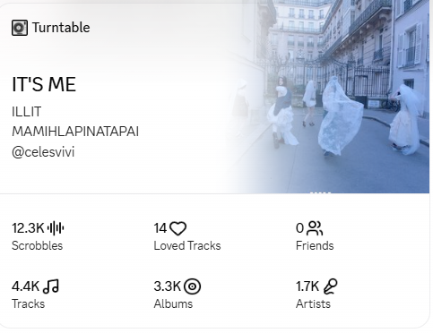
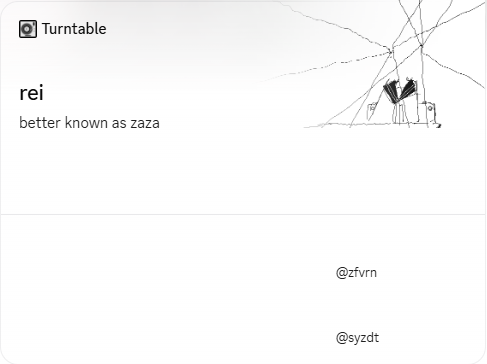

# Turntable


A customizable Discord Social SDK widget powered by Last.fm.

## Features

- 🎵 Live Last.fm scrobbling
- 🖼️ Album artwork with fallback
- 👤 Personal profile mode (shown automatically when nothing is playing)
- 🎧 Music mode (shown while a track is playing)
- 📊 Listening statistics: scrobbles, loved tracks, friends, tracks, albums, artists
- 🔄 Auto updates, sending only when something changed

## Installation

```bash
git clone https://github.com/rziy/turntable.git
cd turntable
npm install
```

Copy `.env.example` to `.env` and fill it in:

```env
LASTFM_USER=
LASTFM_API_KEY=
DISCORD_APP_ID=
DISCORD_USER_ID=
DISCORD_BOT_TOKEN=
```

Run:

```bash
npm start
```

Development (auto restart, needs dev dependencies):

```bash
npm run dev
```

## Configuration

Optional environment variables:

| Variable          | Default | Description                                              |
| ----------------- | ------- | -------------------------------------------------------- |
| `FORCE_MODE`      | auto    | `music` or `personal` to lock one mode                   |
| `UPDATE_INTERVAL` | `30`    | Seconds between checks (minimum 10)                      |
| `STATS_TTL`       | `300`   | Seconds to cache Last.fm totals (minimum 30)             |

Your personal profile lives in `profile.json`:

```json
{
  "username": "name shown in personal mode",
  "title": "main title",
  "subtitle": "line under the title",
  "labels": { "3": "@handle", "6": "@other" },
  "miniText": "text next to the mini avatar",
  "activity": "Personal Profile"
}
```

`labels` keys `1` to `6` map to the six stat slots. Icons and images are listed in `src/icons.js`.

## Modes

### Music



Displays your currently playing track.

### Personal



Displays your custom profile.

## Hosting on a free panel

- Upload everything except `.env`, `.git` and `node_modules`.
- Set the start command to `npm start` (or `node index.js`) and run `npm install` once.
- Add the variables from `.env.example` either in the panel's environment settings or in a `.env` file created on the server.
- No web port is needed. The app only makes outgoing requests, and memory use is small.
- Errors back off automatically (up to 5 minutes) and Discord rate limits are respected.

## Tests

```bash
npm test
```

## License

MIT. See `LICENSE`.

Copyright (c) 2026 rziy.
